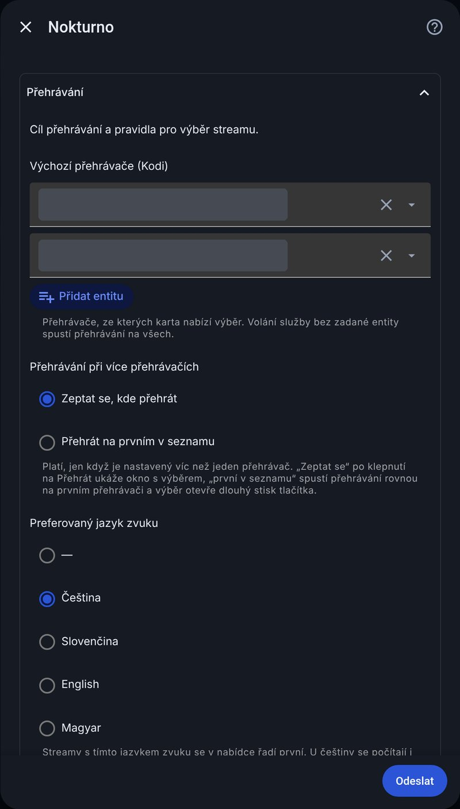
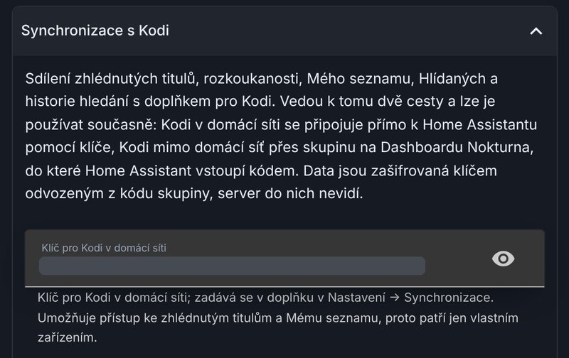

# Nastavení

Všechna pole jsou v **Nastavení → Zařízení a služby → Nokturno → Konfigurovat**. Stejný formulář vyplňuješ i při prvním přidání integrace. Nic není povinné – vyplň jen zdroje, které opravdu používáš. U každého pole je pod ním krátká nápověda.

Formulář má sedm sbalitelných sekcí, popsaných níž v tomto pořadí. Co jednotlivé volitelné zdroje dělají a co potřebují, je podrobně v [návodu pro Kodi, stránka Zdroje a účty](../kodi/zdroje-a-ucty.md) – platí i tady.

## Přehrávání

- **Výchozí přehrávače (Kodi)** – přehrávače (`media_player`), ze kterých karta nabízí výběr. Jde vybrat víc. Volání služby `nokturno.play` bez zadané entity spustí přehrávání na všech.
- **Přehrávání při více přehrávačích** – platí, jen když je vybraný víc než jeden přehrávač:
  - *Zeptat se, kde přehrát* – po klepnutí na Přehrát se ukáže okno s výběrem přehrávače.
  - *Přehrát na prvním v seznamu* – pustí rovnou na prvním přehrávači; výběr vyvolá dlouhý stisk tlačítka Přehrát.
- **Preferovaný jazyk zvuku** – `—` (bez preference) / CZ / SK / EN / HU. Streamy s tímto jazykem se řadí první; u češtiny se počítají i slovenské titulky a naopak.
- **Preferovat prostorový zvuk (5.1 a víc)** – mění jen pořadí, stereo streamy nemizí.
- **Skrýt SD streamy** – streamy pod 720p se nenabídnou. U starších titulů tím nabídka může zůstat prázdná.
- **Max. datový tok (Mb/s, 0 = bez omezení)**
- **Řazení streamů** – *Pořadí od zdroje* / *Nejlepší kvalita napřed* / *Od největšího souboru* / *Od nejmenšího souboru*. Rozhoduje, když je jazyk i zvuk shodný.

## Zdroje a účty

Prázdné pole = zdroj se nepoužívá. Hesla zůstávají v Home Assistantu a odcházejí jen zdroji, kterému patří.

| Pole | K čemu |
|---|---|
| **WebShare – e-mail**, **heslo (nebo uložený hash)** | Přihlášení k WebShare. Heslo může být obyčejné, nebo 40znakový salted hash. Konec předplatného integrace pozná sama a ukáže ho senzor Stav zdrojů. |
| **Streamuj.tv – uživatel (pro Sosáč)**, **heslo** | Bez účtu Streamuj.tv Sosáč tituly najde, ale nepřehraje. |
| **Sledujteto – e-mail**, **heslo** | Hledá se s každým účtem, přehrát jde jen s Premium. |
| **FastShare / Sdilej.cz – uživatel**, **heslo** | Hledá se i bez účtu, přehrání jde z kreditu nebo s neomezeným tarifem. Mimo Kodi (mobil, jiný přehrávač, stažení) jde soubor přes Home Assistant, protože potřebuje přihlášení. |
| **FastShare – účet z** | *FastShare.cz* nebo *Sdilej.cz*. Oba weby mají stejné soubory, účty jsou oddělené – vyber ten, kde máš účet a kredit. Podrobně v nápovědě: [FastShare s účtem ze Sdilej.cz](../../cs/sdilej-cz.md). |
| **Používat HellSpy** | HellSpy účet nepotřebuje. Když odmítne dotazy (HTTP 429), integrace ho 10 minut vynechá. HTTP 429 u HellSpy obvykle znamená, že odmítá celou síť (VPN, mobilní data). |
| **Používat Přehraj.to** | Zapnuté ve výchozím stavu, funguje i bez účtu (první strana výsledků, překódovaný soubor v 1080p). |
| **Přehraj.to – e-mail**, **heslo (nepovinné)** | S Premium přibude stránkování a původní soubor včetně 4K. Přehraj.to počítá každé přihlášení jako zařízení, proto se integrace přihlašuje jen jednou za pár hodin. |
| **Používat CZtor** | Placený katalog cztor.com. Zapnutí otevře krok s PINem, viz [CZtor](#cztor). |
| **Luna – adresa serveru**, **token (nebo celá instalační URL)** | Adresa serveru Luny (`http://IP:7126`) a token ze stránky `/setup` Luny. Stačí vložit celou instalační adresu, token se z ní načte. Luna může běžet jako doplněk tohoto Home Assistantu, ale i na počítači, NAS nebo přímo na Android TV boxu; vždy potřebuje WebShare VIP. Postup je v [návodu pro Kodi](../kodi/nastaveni-luny.md). |
| **Upozornit N dní před koncem předplatného WebShare (0 = vypnuto)** | Kdy přijde upozornění na konec VIP. |

Bez jediného zdroje katalog a hledání fungují dál (přes veřejné databáze filmů, s klíčem TMDB i česky). K přehrání je potřeba vlastní úložiště nebo aspoň jeden zdroj.

### CZtor

Po zapnutí **Používat CZtor** se otevře krok se spárováním:

1. Na telefonu nebo počítači otevři `cztor.com/activate`, přihlas se a zadej PIN, který ukáže Home Assistant. Zařízení se na webu CZtoru jmenuje „Nokturno (Home Assistant)“.
2. V Home Assistantu dej **Odeslat**.
3. Nepotvrzený PIN hlásí chybu (nejdřív ho potvrď na webu); vypršelý PIN je potřeba vyžádat znovu. Vypnutím přepínače se CZtor vypne a formulář se uloží bez spárování.

Heslo k účtu integrace nikdy nevidí, uloží se jen přístupové tokeny. Jestli je účet spárovaný, ukáže senzor [Stav zdrojů](sluzby-a-senzory.md#stav-zdroju). Podrobně v nápovědě: [CZtor: „zařízení není spárované“](../../cs/cztor.md).

## Vlastní úložiště

Sekce **Vlastní úložiště (WebDAV)** – až tři složky s vlastními soubory (NAS, Nextcloud, server). Prohledávají se spolu se zdroji a nalezené soubory se nabídnou mezi streamy jako první. Pro každé úložiště (1–3):

| Pole | K čemu |
|---|---|
| **Úložiště N – adresa složky (WebDAV)** | např. `https://nas.example.cz:5006/video/` nebo `https://cloud.example.cz/remote.php/dav/files/jmeno/Video/`. Prázdné = úložiště vypnuté. |
| **Úložiště N – uživatel**, **heslo** | přihlášení k úložišti (HTTP Basic); bez hesla nech prázdné |
| **Úložiště N – název u streamů** | např. `NAS` – ukáže se v kartě na zeleném štítku u streamu |

Úložiště musí být dosažitelné **z Home Assistantu** – Home Assistant soubory prochází a přehrávačům je předává. Jak soubory pojmenovat, aby se přiřadily k titulům (rok u filmu, `S01E02` u dílu), je v [návodu pro Kodi → Vlastní úložiště](../kodi/vlastni-uloziste.md) a platí i tady.

## Torrenty

Nepovinné. Torrenty se nabízejí jen na vyžádání (tlačítko **Hledat torrenty** v detailu titulu), když streamy nestačí.

- **Prowlarr – adresa (hledání torrentů)**, **API klíč** – Prowlarr sdružuje torrentové indexery. Bez něj se torrenty nevyhledávají.
- **qBittorrent – adresa** (včetně portu, výchozí 8080), **jméno** (jen když webové rozhraní vyžaduje přihlášení), **heslo** – kam se torrenty posílají ke stažení.

## Stahování a odkazy

- **Složka pro stahování** – složka na disku Home Assistantu, např. `/media/nokturno`. Musí existovat a být zapisovatelná. Přerušené stahování (restart, výpadek) naváže tam, kde skončilo; zdroj, který přestane posílat data, se po 2 minutách ticha vzdá a stahování jde zkusit znovu.
- **Adresa mimo domácí síť (Tailscale/VPN) – pro odkazy do mobilu** – adresa, na které je Home Assistant dostupný zvenku (VPN, reverzní proxy, Nabu Casa). Použije se v odkazech poslaných do mobilu.
- **Oznámení o stažení a nových dílech** – služba oznámení, např. `notify.mobile_app_telefon`. Prázdné = oznámení zůstanou jen v Home Assistantu.

## Synchronizace s Kodi

Sdílení zhlédnutých titulů, rozkoukanosti, Mého seznamu, historie hledání a Hlídaných s doplňkem pro Kodi. Obě cesty jdou používat současně:

- **Klíč pro Kodi v domácí síti** – Kodi v domácí síti se připojí přímo k Home Assistantu. Klíč zadáš v Kodi v *Nastavení → Synchronizace* (středisko Home Assistant). Klíč dává přístup ke zhlédnutým titulům, patří jen tvým zařízením.
- **Kód skupiny (pro Kodi mimo domácí síť)** – kód `NKT-XXXX-XXXX-XXXX-XXXX` z prvního Kodi (*Nastavení → Synchronizace → Založit skupinu / otevřít připojení*). Home Assistant se stane dalším členem skupiny a přebírá změny i od Kodi mimo domácí síť. Prázdné = do skupiny nevstupuje.
- **Synchronizovat zhlédnuté a rozkoukané**, **Synchronizovat Můj seznam**, **Synchronizovat historii hledání**, **Synchronizovat Hlídané** – každý okruh jde vypnout zvlášť. Vypnutý se neodesílá ani nepřijímá. S hlídanými stačí kontrolu udělat na jednom zařízení.

Data ve skupině jsou zašifrovaná klíčem odvozeným z kódu, server do nich nevidí. Podrobně v [návodu pro Kodi → Synchronizace a přenos](../kodi/synchronizace.md).

## Ostatní

- **TMDB – API klíč** (nepovinné) – vlastní klíč zdarma z themoviedb.org. S ním jsou názvy a popisy česky i bez Luny a má přednost i před ní. Návod na založení je v [návodu pro Kodi](../kodi/zdroje-a-ucty.md#tmdb-api).
- **Trakt.tv – vlastní Client ID**, **Client Secret** (nepovinné) – nech prázdné, použije se aplikace Nokturna. Propojení pak spustíš službou `nokturno.trakt_auth`: kód přijde do oznámení a zadáš ho na `trakt.tv/activate`. Vlastní aplikaci na Traktu zakládat nemusíš, jde to i s free účtem. Podrobně v nápovědě: [Trakt.tv: přihlášení kódem](../../cs/trakt.md).
- **Posílat anonymní statistiky** – náhodné id, verze a přehrané tituly, bez účtů, adres a obsahu. Vypnuté posílá jen id a verzi.

Pokračuj na [Používání](pouzivani.md).
