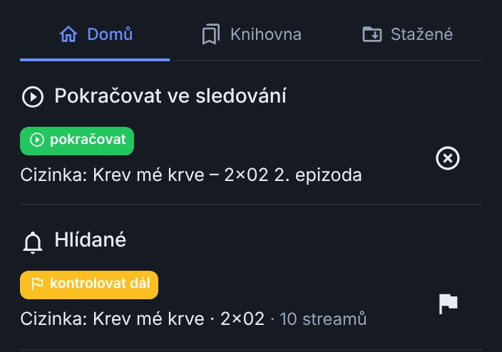
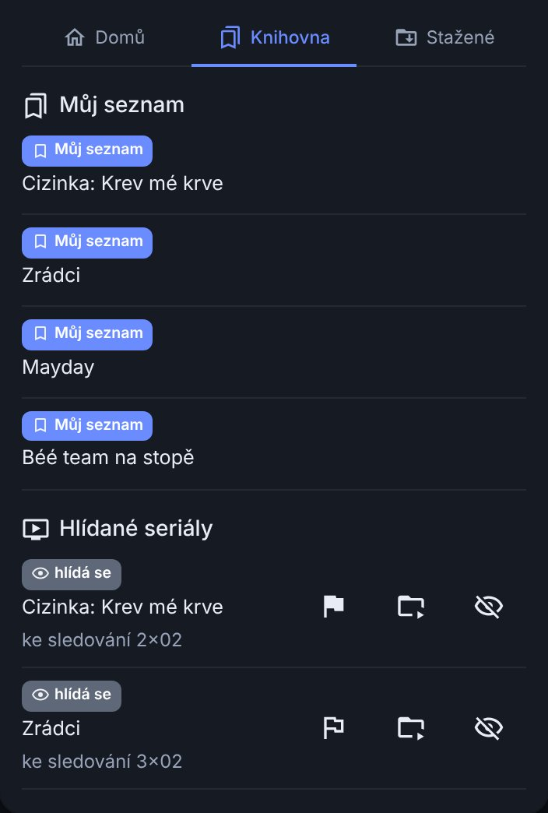
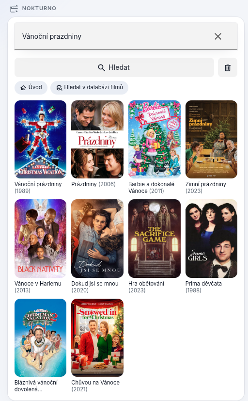
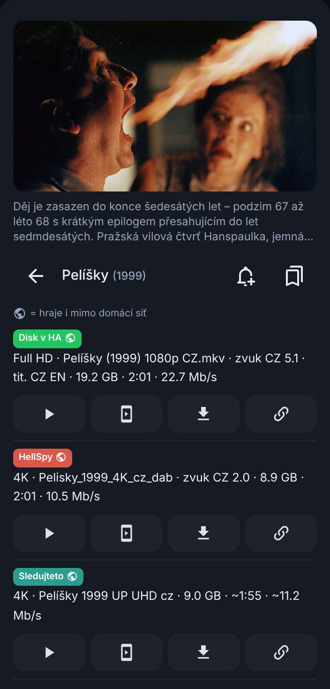
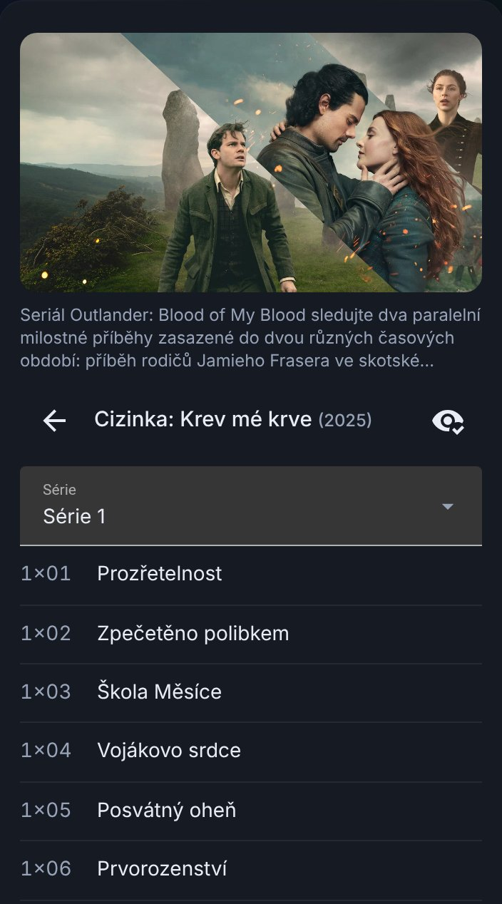

# Používání

## Karta na dashboardu

Nahoře je vyhledávací pole s tlačítkem **Hledat** – jedno hledání pro filmy i seriály ve všech nastavených zdrojích. Pod ním jsou poslední dotazy (klepnutím se hledání zopakuje, křížkem se historie smaže) a tři záložky:

- **Domů**
  - **Pokračovat ve sledování** – rozkoukané filmy a seriály ze všech Kodi. Karta si pamatuje poslední známý stav, takže nezůstane prázdná, když zrovna žádné Kodi neběží.
  - **Hlídané** – hlídané tituly a díly se stavem (lze pustit, jen torrent, hlídá se, zatím bez streamu), viz [Hlídané](#hlidane) níž.
- **Knihovna**
  - **Můj seznam** – uložené tituly, sdílené s Kodi.
  - **Hlídané seriály** – seriály, u kterých se hlídají nové díly. Nový díl je zvýrazněný.
- **Stažené** – probíhající i hotová stahování do Home Assistantu. Počet běžících je vidět přímo na záložce.

 

## Hledání a detail titulu

Po zadání dotazu a klepnutí na **Hledat** se ukáže mřížka plakátů. Když hledání najde filmy i seriály, přepínač nabídne obě skupiny zvlášť.

Otevřením filmu se načtou streamy, u seriálu nejdřív seznam dílů:

 

- Nahoře plakát, pozadí a popis. V hlavičce jsou tlačítka **Přidat do Hlídaných** (zvonek), **Přidat do Mého seznamu** (záložka), u rozkoukaného titulu **Odebrat z Pokračovat ve sledování** a u titulu se streamy v nechtěné kvalitě **vlaječka Kontrolovat dál**.
- U seriálu se nejdřív vybírá díl; v hlavičce seznamu dílů je **Hlídat nové díly** (oko).
- Barevný štítek u streamu říká, odkud stream je. Ikona zeměkoule = stream hraje i mimo domácí síť.
- U každého streamu jsou tlačítka **Přehrát**, **Poslat do mobilu**, **Stáhnout** a **Zkopírovat odkaz**.

### Přehrát

Titul se pustí v Kodi přes doplněk Nokturno, takže si Kodi vede rozkoukanost. Když máš v [Nastavení](nastaveni.md#prehravani) víc přehrávačů, karta se podle volby **Přehrávání při více přehrávačích** buď zeptá, kde přehrát, nebo pustí na prvním v seznamu a výběr nabídne na dlouhý stisk tlačítka Přehrát. Přehraje se vždy přesně ten stream, na který klepneš.

### Když automatické hledání nestačí

Dole v seznamu streamů je tlačítko **Zkusit fulltext na …** (vyjmenuje zapnuté fulltextové zdroje – WebShare, HellSpy, Sledujteto, FastShare). Spustí uvolněnější hledání, které najde i soubory s neobvyklým názvem. Takové výsledky mají u sebe otazník – jde o neověřenou shodu, jestli soubor k titulu patří, posuď podle názvu.

Máš-li nastavený Prowlarr a qBittorrent, je tam i **Hledat torrenty**. Torrent se stáhne přes qBittorrent a přehrát jde, až se stáhne.

## Soubory z vlastního úložiště

Když máš v [Nastavení](nastaveni.md#vlastni-uloziste) vyplněné úložiště, soubory, které k titulu patří, jsou v detailu **mezi streamy vždy první**, se **zeleným štítkem** s názvem úložiště. Dál se s nimi pracuje stejně jako s ostatními streamy:

- **Přehrát v Kodi** – Kodi dostane přímý odkaz na soubor i s přihlášením k úložišti. Doplněk v Kodi úložiště nastavené mít nemusí.
- **Přehrát na jiném přehrávači** (TV, Chromecast, prohlížeč), **Poslat do mobilu** a **Zkopírovat odkaz** – soubor jde přes Home Assistant a přehrávač dostane dočasný podepsaný odkaz (platí 12 hodin, do mobilu 24 hodin). Přetáčení funguje, heslo k úložišti z Home Assistantu neodejde.
- **Stáhnout** – stáhne soubor z úložiště do složky pro stahování.

Nový soubor se v úložišti objeví nejpozději do hodiny, viz [návod pro Kodi](../kodi/vlastni-uloziste.md#kdy-doplnek-uvidi-novy-soubor).

## Hlídané

Integrace hlídá na pozadí dvě věci a pošle oznámení, až se dá opravdu dívat:

- **Hlídané seriály** – kontrola každých 6 hodin. Nový díl se ohlásí, až **má stream**, ne jen když byl odvysílaný. Díly bez data vydání se nehlídají (teprve se natáčejí). Když ve zdrojích chybí díly uprostřed série, kontrola zkusí i nejnovější sérii.
- **Hlídané tituly** – vlastní seznam a propojený watchlist Trakt.tv. Kontrola jednou denně ohlásí **první nalezený stream** i to, že **přibyl další zdroj** (třeba lepší kvalita nebo další jazyk). Titul, který zatím nikde není, se hlídá, dokud se neobjeví.

**Kontrolovat dál (vlaječka)** – titul nebo díl má streamy, ale ne takové, jaké chceš (třeba bez českých titulků nebo bez 5.1). Vlaječkou ho označíš a kontrola se ozve, až streamů přibude. U hlídaného seriálu je vlaječka pro poslední dostupný díl přímo v Knihovně; díl se v kartě ukáže jako `Seriál · 2x02`.

U položky Hlídaných jde titul jedním klepnutím přesunout do Mého seznamu – pak se přestane hlídat.

S [synchronizací](#synchronizace-s-kodi) se Hlídané sdílí s Kodi: kontrolu stačí udělat na jednom zařízení a Home Assistant ohlásí i díl, který našlo Kodi.

Podrobně v nápovědě: [Hlídané: nové díly a Kontrolovat dál](../../cs/hlidane.md).

## Stahování a odkazy do mobilu

**Stáhnout** u streamu stáhne soubor i s titulky do [složky pro stahování](nastaveni.md#stahovani-a-odkazy). Když titulky zrovna nejdou stáhnout, přehrání ani stažení to nezastaví – video se pustí nebo stáhne bez nich. Hotový soubor je v záložce **Stažené** i v Media Browseru Home Assistantu. **Poslat do mobilu** pošle odkaz přes službu oznámení; mimo domácí síť funguje díky nastavené adrese mimo domácí síť.

## Synchronizace s Kodi

Zhlédnuto, rozkoukaná pozice, **Můj seznam**, historie hledání a Hlídané se sdílí obousměrně s doplňkem pro Kodi. Vedou k tomu dvě cesty, obě jdou používat současně (Nastavení integrace → sekce *Synchronizace s Kodi*):

- **Kodi v domácí síti** – přes klíč (v Kodi: *Nastavení → Synchronizace → Středisko synchronizace: Home Assistant*).
- **Kodi kdekoli** – přes skupinu Dashboardu Nokturna: první Kodi skupinu založí a ukáže kód `NKT-XXXX-XXXX-XXXX-XXXX`, ten zadáš do pole *Kód skupiny*. Home Assistant se stane dalším členem skupiny. Data jsou zašifrovaná a server je nepřečte.

Každý okruh jde vypnout zvlášť. Běží na pozadí, žádná ruční akce není potřeba. Podrobnosti v [Nastavení](nastaveni.md#synchronizace-s-kodi).

## Stav zdrojů

Senzor **Stav zdrojů** ukazuje, které zdroje potřebují zásah (vypršelé předplatné, nespárovaný CZtor, Luna, která neběží…). Hodnota `0` = vše v pořádku. Podrobně na stránce [Služby a senzory](sluzby-a-senzory.md#stav-zdroju).

Pokračuj na [Služby a senzory](sluzby-a-senzory.md), nebo na [Řešení problémů](reseni-problemu.md), pokud něco nefunguje.
