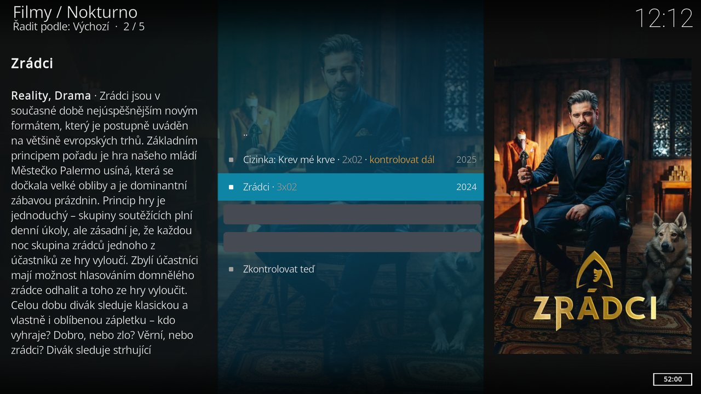

# Hlídané

Nokturno umí samo hlídat, až vyjde nový díl seriálu, nebo až se objeví film, který zatím nikde není. Když se něco najde, ukáže oznámení a v hlavním menu přibude u položky **Hlídané** počet nových dílů.

Podrobně v nápovědě: [Hlídané: nové díly a Kontrolovat dál](../../cs/hlidane.md).

## Co jde hlídat

- **Hlídat nové díly** – místní nabídka seriálu. Nokturno seriál kontroluje každých šest hodin a ohlásí nový díl, jakmile ho některý zdroj má.
- **Hlídat, až bude k dispozici** – místní nabídka filmu. Hodí se na film, který zatím nemá žádný stream. Kontroluje se jednou denně.
- **Kontrolovat dál** – místní nabídka dílu. Díl streamy má, ale ne takové, jaké chceš (třeba bez českých titulků). Nokturno se ozve, až streamů přibude.

Když hledání streamu nic nenajde ani volnějším hledáním podle názvu souboru, doplněk se sám zeptá, jestli se má ozvat, až titul nebo díl bude k dispozici.

Máš-li připojený [Trakt.tv](zdroje-a-ucty.md#trakttv), hlídají se i tituly z tvého watchlistu na Traktu.

## Menu Hlídané

Položka v hlavním menu hned pod Pokračovat ve sledování. Ukáže se, jen když něco hlídáš.

- **Seriály** jsou nahoře, ty s novým dílem úplně první. U seriálu je číslo dílu (`Seriál · 3x02`) a u nového dílu barevně „nový díl“. Otevření seriálu nový díl zhasne.
- **Tituly** mají u sebe stav: *lze pustit*, *jen torrent*, *hlídá se*, *zatím ne*, nebo *kontrolovat dál*.
- Díl s příznakem Kontrolovat dál u seriálu, který hlídáš, je na řádku seriálu. Klik na hlídaný díl otevře rovnou výběr streamu.
- **Zkontrolovat teď** – na konci seznamu a v místní nabídce. Zkontroluje všechno hned, bez čekání na další kolo.

Místní nabídka v Hlídaných dál nabízí **Označit nový díl jako viděný**, **Kontrolovat dál** / **Nekontrolovat dál**, **Přestat hlídat nové díly** a **Přestat hlídat**.

## Kdy se kontroluje

Kontrolu dělá služba doplňku na pozadí: seriály každých šest hodin, tituly jednou denně. Během přehrávání a bez připojení k internetu se nekontroluje.

S [synchronizací](synchronizace.md) se Hlídané sdílí mezi tvými Kodi i s Home Assistantem (volba **Synchronizovat Hlídané**). Když titul zkontroluje jedno zařízení, ostatní kontrolu neopakují, a oznámení o novém dílu dostane každé zařízení samo.
