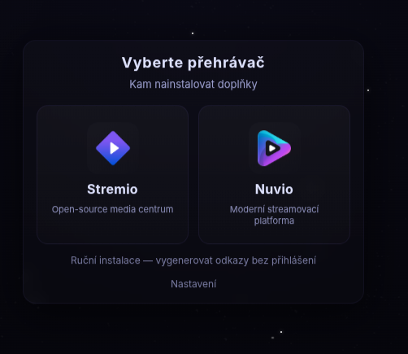
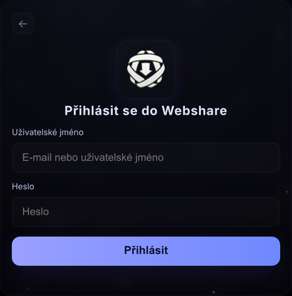
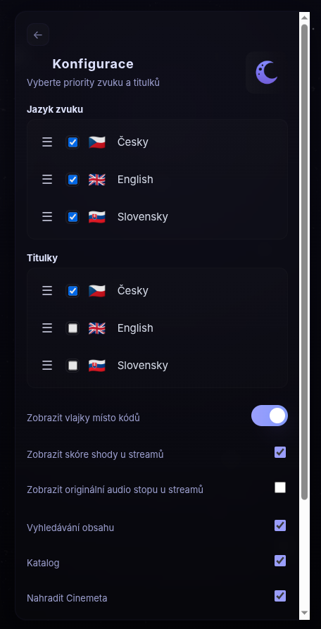
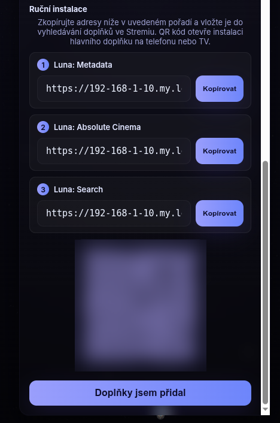
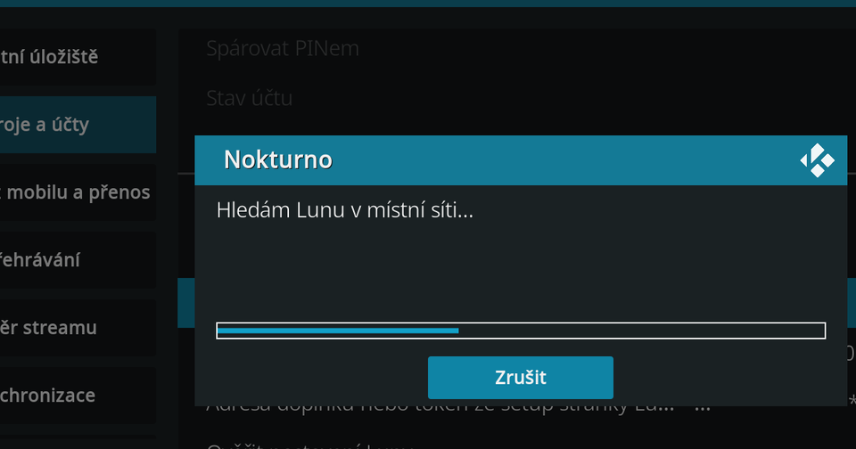
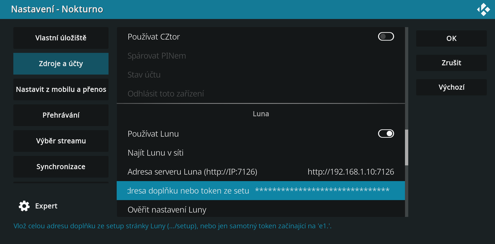
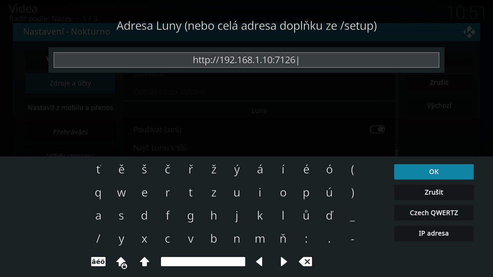
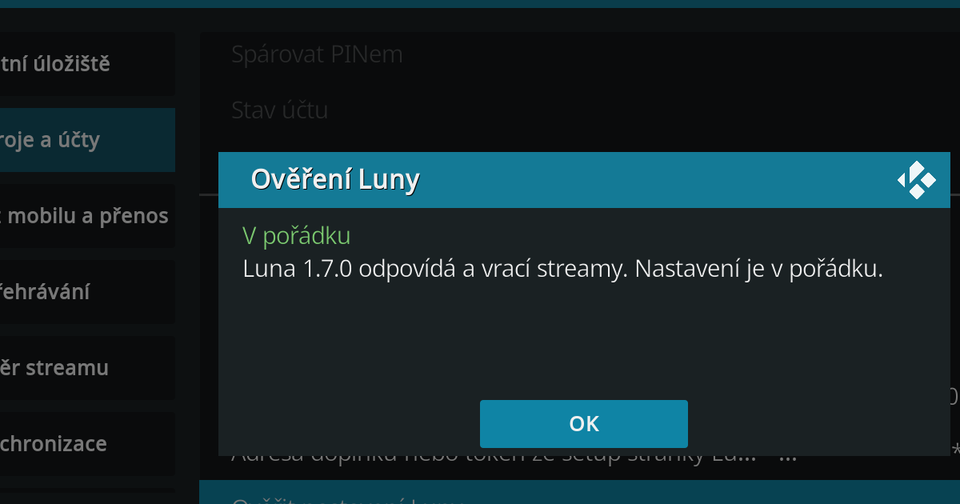
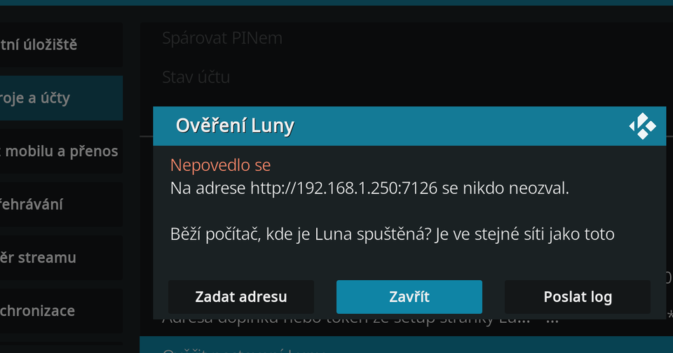

# Nastavení Luny krok za krokem

Luna: Absolute Cinema je samostatný server, přes který Nokturno přehrává obsah z WebShare. Dodává i katalogy, plakáty a české popisy. Nokturno se k ní připojuje po síti, podobně jako Stremio.

Návod má tři kroky:

1. [Spustit Lunu](#1-spustit-lunu) na zařízení v domácí síti.
2. [Přihlásit v Luně WebShare a zkopírovat adresu doplňku](#2-prihlasit-webshare-a-zkopirovat-adresu-doplnku).
3. [Vložit adresu do Nokturna a ověřit ji](#3-vlozit-adresu-do-nokturna).

Nejčastější chyba je **„Luna běží, ale chybí token“**. Znamená, že máš hotový první krok, ale chybí druhý a třetí. Pokračuj [krokem 2](#2-prihlasit-webshare-a-zkopirovat-adresu-doplnku).

## Co potřebuješ

- **WebShare s VIP účtem.** Bez VIP Luna nic nepřehraje.
- **Zařízení, na kterém Luna poběží**, viz krok 1. Home Assistant **není potřeba**.
- Nokturno v Kodi, viz [Instalace](instalace.md).

## 1. Spustit Lunu

Lunu nevyvíjíme my. Stahuje se a popisuje na oficiálním vlákně [Luna: Absolute Cinema na stremio.cz](https://stremio.cz/d/47-luna-absolute-cinema-addon-pro-prehravani-sifrovaneho-obsahu-z-webshare). Vyber si jednu z cest:

| Kde Luna běží | Jak | Adresa Luny v Nokturnu |
|---|---|---|
| **Na stejném Android TV boxu jako Kodi** | nainstaluj aplikaci Luna (APK, např. přes Downloader) a spusť ji, běží pak na pozadí | `http://127.0.0.1:7126` |
| **Na počítači s Windows** | spusť program, v oznamovací oblasti se objeví ikona měsíce | `http://IP-počítače:7126` |
| **Na Linuxu, macOS, NAS nebo Raspberry Pi** | spusť program, adresy vypíše v terminálu | `http://IP-zařízení:7126` |
| **V Home Assistantu** | doplněk Luna ([návod na stremio.cz](https://stremio.cz/d/47-luna-absolute-cinema-addon-pro-prehravani-sifrovaneho-obsahu-z-webshare)) | `http://IP-Home-Assistantu:7126` |

Pokud Luna neběží přímo na TV boxu, musí být zařízení s Lunou zapnuté pokaždé, když chceš přehrávat. Musí být taky ve stejné síti jako Kodi. Nejpohodlnější je zařízení, které běží stále (NAS, Home Assistant, počítač, který se nevypíná).

Port je vždy **7126**, pokud se v Luně nezměnil.

## 2. Přihlásit WebShare a zkopírovat adresu doplňku

Tento krok dělej **na mobilu nebo na počítači**, ne na TV. Dlouhou adresu se tak nebudeš muset vypisovat ovladačem.

Otevři v prohlížeči stránku nastavení Luny. Je to adresa z tabulky výše s koncovkou `/setup`, například `http://192.168.1.10:7126/setup`. Pokud Luna běží na TV boxu, zadej IP adresu boxu. `127.0.0.1` funguje jen přímo na boxu.

**a) Vyberte přehrávač.** Stremio ani Nuvio nevybírej. Klikni dole na **Ruční instalace — vygenerovat odkazy bez přihlášení**.



**b) Přihlásit se do Webshare.** Zadej jméno a heslo svého WebShare účtu (s VIP) a klikni na **Přihlásit**. Údaje zůstanou jen v tvé Luně, Nokturno je nikdy neuvidí.



**c) Konfigurace.** Nastav pořadí jazyků zvuku a titulků. Luna podle něj řadí streamy, které Nokturnu posílá. Nech zapnuté **Vyhledávání obsahu** a **Katalog**.



**d) Ruční instalace.** Luna ukáže tři adresy: Metadata, Absolute Cinema a Search. **Je jedno, kterou zkopíruješ.** Všechny nesou stejný token a Nokturno si z nich vezme jen adresu serveru a token. Doporučujeme prostřední **Luna: Absolute Cinema**, tlačítko **Kopírovat**.



Adresa končí zhruba takto (token začíná `e1.` a je mnohem delší):

```
…:7126/e1.AbCdEf…/manifest.json
```

Adresu ani QR kód nikomu neposílej a nikde nezveřejňuj. Obsahuje tvůj token.

## 3. Vložit adresu do Nokturna

V Kodi otevři **Nokturno → Nastavení → Zdroje a účty** a sjeď ke skupině **Luna**.


1. Zapni **Používat Lunu**.
2. Klikni na **Najít Lunu v síti**. Nokturno projde domácí síť a adresu serveru vyplní samo. Rovnou pak spustí ověření.

   

   Pokud Lunu nenajde, vyplň **Adresu serveru Luna** ručně podle tabulky v kroku 1.
3. Do pole **Adresa doplňku nebo token ze stránky /setup Luny** vlož **celou** adresu zkopírovanou v kroku 2d. Nokturno si z ní samo vezme adresu serveru i token. Pole je skryté hvězdičkami, stejně jako heslo.

   

4. Klikni na **OK**. Nastavení se uloží a zavře. Otevři ho znovu a klikni na **Ověřit nastavení Luny**. Ověřuje se jen uložené nastavení, hodnota rozepsaná v políčku se započítá až po OK.

Místo kroků 3 a 4 můžeš rovnou kliknout na **Ověřit nastavení Luny** a celou adresu z kroku 2d vložit do dotazu, který se objeví. Nokturno ji ověří a adresu serveru i token uloží samo.

### Nejjednodušší cesta: vložit adresu z mobilu

Vypisovat token ovladačem je utrpení. V nastavení Nokturna otevři kategorii **Nastavit z mobilu a přenos** a klikni na **Nastavit z mobilu**. Na TV se ukáže QR kód. Naskenuj ho mobilem, rozbal sekci **Luna** a do pole pro adresu doplňku vlož adresu zkopírovanou v kroku 2. Uložením se hodnota zapíše přímo do Kodi. Na stránce jsou i tlačítka **Najít Lunu v síti** a **Ověřit nastavení Luny**.

Mobil musí být ve stejné síti jako Kodi.

## Ověření

Tlačítko **Ověřit nastavení Luny** se nejdřív zeptá na adresu. Předvyplněná je ta uložená, takže stačí **OK**. Sem jde vložit i celou adresu doplňku a ověřit ji bez ukládání nastavení.



Když je všechno v pořádku:



Když něco nesedí, ověření napíše přesně co. Nabídne taky **Zadat adresu** (zkusit jinou) a **Poslat log** (pošle nám log, viz níže).



### Co která hláška znamená

Co znamená každá hláška z **Ověřit nastavení Luny** a co s ní udělat: [Co znamenají hlášky z Ověřit nastavení Luny](../../cs/luna-hlasky.md).

Hláška **„Luna: běží, ale chybí token“** se může ukázat i nahoře v hlavním menu Nokturna jako stav zdrojů. Postup je v [kroku 2](#2-prihlasit-webshare-a-zkopirovat-adresu-doplnku) a [kroku 3](#3-vlozit-adresu-do-nokturna).

## Pořád to nejde?

Nejčastější chyby řeší návody [Luna: „server neodpovídá“](../../cs/luna-neodpovida.md) a [Luna: „běží, ale chybí token“](../../cs/luna-token.md). Když nepomůžou, klikni při chybě ověření na **Poslat log** (nebo *Nastavení → Pokročilé → Odeslat log Kodi*). Hesla, tokeny ani IP adresy v logu nejsou, doplněk je před odesláním vymaže. Pak nám napiš na [Discord](https://discord.gg/ChmMPmDDEj) do fóra #pomoc. Podíváme se na to a odpověď pošleme přímo do tvého Kodi.

Když Lunu používat nechceš, stačí přepínač **Používat Lunu** vypnout. Nokturno bez ní funguje dál s WebShare a dalšími zdroji, viz [Zdroje a účty](zdroje-a-ucty.md).
