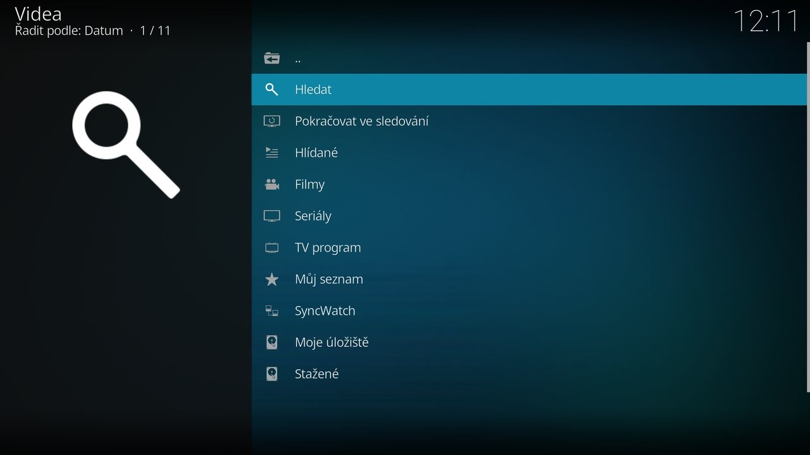
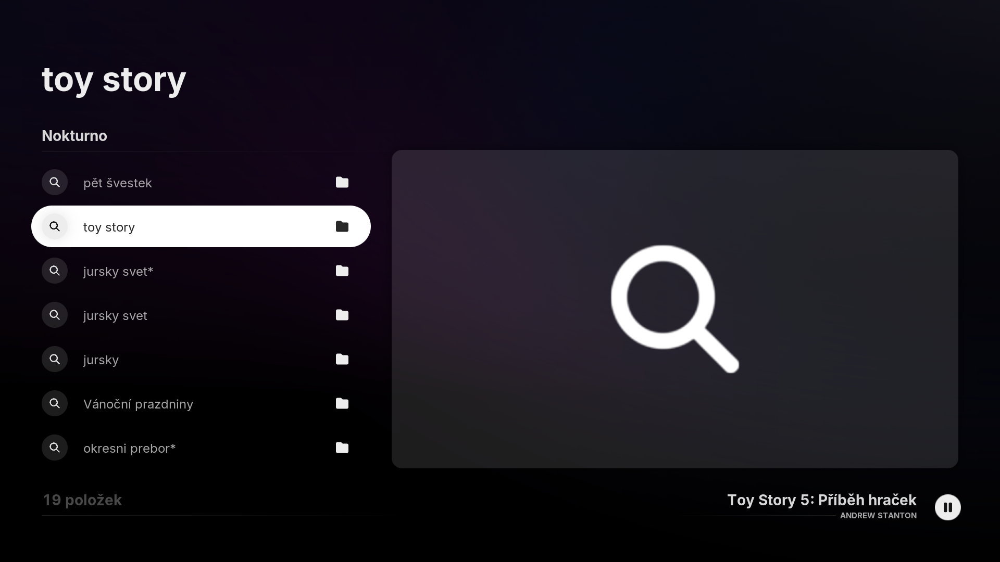
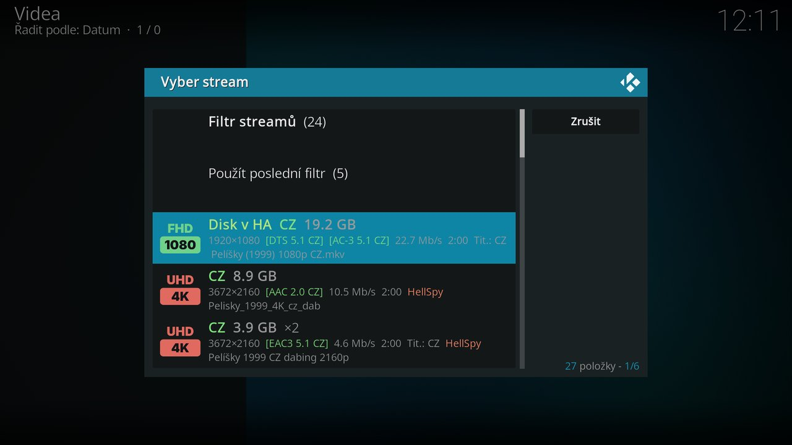

# Používání

## Hlavní menu

Položky shora dolů. Některé se ukážou, jen když mají co nabídnout – na čisté instalaci proto menu vypadá kratší.

| Položka | Kdy se ukáže | Co v ní je |
|---|---|---|
| řádek se jménem zdroje a problémem, třeba **Luna: server neodpovídá** | jen když je u některého zdroje co řešit | výpis **Stav zdrojů**, viz [níž](#stav-zdroju) |
| **Průvodce nastavením** | dokud nemáš nastavený žádný zdroj | [průvodce prvním nastavením](instalace.md#pruvodce-prvnim-nastavenim) |
| **Novinky ve verzi** | po aktualizaci, dokud je nepřečteš | co přinesla nová verze |
| **Hledat** | vždy | jedno hledání ve všech zapnutých zdrojích, pro filmy i seriály naráz |
| **Pokračovat ve sledování** | když máš něco rozkoukaného | rozkoukané filmy a další díly rozkoukaných seriálů (jen díly, které už vyšly) |
| **Hlídané** | když něco hlídáš | hlídané seriály a tituly, u nového dílu i jejich počet – viz [Hlídané](hlidane.md) |
| **Filmy**, **Seriály** | vždy | katalogy včetně vlastních, viz [Filmy a Seriály](#filmy-a-serialy) |
| sezónní katalogy | jen v sezóně | občas přidáme katalog na určité období, třeba vánoční filmy |
| **TV program** | vždy | česká a slovenská televize spárovaná s databází filmů |
| **Můj seznam** | když v něm něco máš nebo už máš něco zhlédnuté | uložené tituly, **Naposledy zhlédnuté** a **Synchronizovat teď** |
| **SyncWatch** | vždy | společné sledování, viz [SyncWatch](syncwatch.md) |
| **Moje úložiště** | s nastaveným vlastním úložištěm | procházení tvých souborů, viz [Vlastní úložiště](vlastni-uloziste.md) |
| **Stažené** | s nastavenou složkou pro stahování | stažené a rozstahované soubory |
| **Nastavení** | vždy | viz [Nastavení](nastaveni.md) |

Občas vám pošleme krátkou zprávu (novinka, výpadek zdroje, odpověď na nahlášený problém). Ukáže se jako posouvatelné okno a nezastaví přehrávání.

## Stav zdrojů

Řádek úplně nahoře v menu se ukáže, jen když je co řešit: končí předplatné WebShare, Luna neodpovídá, účet nemá Premium, CZtor není spárovaný, HellSpy odmítá tvoji síť a podobně. Nese jméno zdroje a problém, třeba „Luna: server neodpovídá“; když je problémů víc, přibude „+N“. Klik otevře výpis **Stav zdrojů** s řádkem pro každý zapnutý zdroj; každý řádek vede tam, kde se to opravuje.

- **Ověřit zdroje** (ve starších verzích Otestovat zdroje) na konci výpisu ověří všechny zdroje znovu hned.
- **Uspat zdroj** (místní nabídka na řádku zdroje) – zdroj se na 10 minut, 1 hodinu nebo 12 hodin přestane používat. Hodí se, když má zdroj výpadek a zdržuje hledání. **Zrušit uspání** ho vrátí.

## Filmy a Seriály

Obě menu mají:

- **Pro Tebe** – doporučení podle naposledy zhlédnutých titulů; u každého titulu je napsáno „Doporučeno podle: …“. Počítá se z historie ve tvém Kodi, nikam se neposílá. Ukáže se, až je z čeho doporučovat.
- **Populární na TMDB**, **Nejlépe hodnocené** – s výběrem žánru.
- **Nejsledovanější tento týden** – žebříček z anonymních statistik uživatelů Nokturna.
- **Vlastní katalogy** – katalog si poskládáš sám podle žánrů, původního jazyka, let a řazení (oblíbenost, hodnocení, datum vydání). **Nový katalog** ho založí, místní nabídka ho upraví nebo smaže. Vlastní klíč TMDB není potřeba. Podrobně v nápovědě: [Vlastní katalogy](../../cs/vlastni-katalogy.md).
- **Náhodný film** / **Náhodný seriál** – vylosuje titul v žánru, který obvykle sleduješ, a rovnou otevře výběr streamu. Přednost mají tituly s tvým preferovaným jazykem; když takový nenajde, vylosuje jiný a napíše to u něj.

U seriálu je v seznamu dílů značkou `»` označený první nezhlédnutý díl po posledním zhlédnutém.

## Hledání

Otevře se pole pro dotaz a pod ním **historie posledních 10 hledání** – klepnutím na starší dotaz se hledání spustí znovu:

Průběh hledání ukazuje ukazatel v rohu obrazovky, dotazy na jednotlivé zdroje běží souběžně. Rok v dotazu funguje jako filtr – `Pět švestek 2026` vrátí jen titul z toho roku; číslo, které je součástí názvu (`Blade Runner 2049`), se za rok nepovažuje.

Když hledání najde filmy i seriály, nabídnou se obě skupiny zvlášť. Stejný titul z víc zdrojů je v seznamu jen jednou – zdroj je vidět až u konkrétního streamu.

## Výběr streamu

Klik na film nebo díl otevře **dialog výběru streamu**. Stejně funguje tlačítko Přehrát v detailu, widget i TMDb Helper. Doplněk souběžně prohledá všechny zapnuté zdroje a seřadí je do jednoho seznamu; průběh ukazuje ukazatel v rohu obrazovky (*Streamy: N · Meta: x/y*).

Každý stream má dva řádky. Vlevo je obrázek kvality (4K, 1080p, 720p…), dál jazyky zvuku, velikost, rozlišení, zvukové stopy, datový tok, délka, titulky a zdroj. Co se ukazuje a v jakém pořadí, nastavíš v [Nastavení → Výběr streamu](nastaveni.md#vyber-streamu). Podrobně v nápovědě: [Výběr streamu: filtry, 3D a poslední filtr](../../cs/vyber-streamu.md).

- **Vlnovka** před jazykem nebo kvalitou (`~CZ`, `~4K`) znamená odhad z názvu souboru. Bez vlnovky je údaj potvrzený zdrojem nebo přečtený z hlavičky souboru.
- **`×3`** – stejné verze souboru (kvalita, zvuk, titulky, velikost do 10 %) jsou sloučené do jednoho řádku. Když jedna kopie nejde přehrát, zkusí se další.
- Když vybraný stream nejde přehrát (vypršelý účet, chybí kredit, smazaný soubor), doplněk sám zkusí další nalezené streamy.
- Zdroj, který neodpoví do 20 sekund, seznam nezdrží – ukáže se, co došlo.
- Streamy, o kterých doplněk ví, že nejdou přehrát, se skryjí a oznámení to řekne.
- 3D soubory skryje volba **Skrýt 3D streamy** v [Přehrávání](nastaveni.md#prehravani).
- U seriálu je předvybraný stream stejného druhu, jaký byl vybraný u předchozího dílu. Při automatickém přehrání (doplněk Up Next, karta v Home Assistantu) se takový stream pustí bez ptaní.

Nahoře v dialogu jsou tyto položky:

- **Filtr streamů** – výběr podle kvality, zvuku, počtu kanálů, kodeku, titulků a zdroje. Nabízí jen to, co se u titulu opravdu našlo. Když by filtr nic nenechal, ukážou se všechny streamy.
- **Zrušit filtr**, **Použít poslední filtr** – poslední filtr si doplněk pamatuje; použít ho jde i automaticky ([Výběr streamu](nastaveni.md#vyber-streamu)).

Dole v dialogu jsou tyto položky:

- **Zobrazit všechny streamy** – rozbalí sloučené kopie.
- **Hledat volněji podle názvu souboru** (ve starších verzích Zkusit uvolněný fulltext) – hledání ve WebShare, HellSpy, Sledujteto a FastShare, které najde i soubory s neobvyklým názvem. Neověřené shody mají oranžovou značku **`?`** – jestli soubor opravdu patří k titulu, posuď podle názvu.

## Místní nabídka titulu

Místní nabídka (podržet OK nebo pravé tlačítko) u filmu a dílu nabízí:

- **Vybrat stream** – dialog výběru i u rozkoukaného titulu, který by jinak pokračoval rovnou.
- **Stáhnout** – stejný dialog, vybraný stream se stáhne místo přehrání.
- **Podobné tituly**
- **Přidat do Mého seznamu** / **Odebrat z Mého seznamu**
- **Hlídat nové díly** (seriál), **Hlídat, až bude k dispozici** (film), **Kontrolovat dál** (díl) – viz [Hlídané](hlidane.md).
- **Označit jako zhlédnuté** / **Označit jako nezhlédnuté**

Označit jako zhlédnuté funguje i z místní nabídky skinu. Změna se promítne do Nokturna, na Trakt.tv i do [synchronizace](synchronizace.md).

## Přehrát z detailu filmu (TMDb Helper)

Skiny jako **Arctic Fuse** ukazují detail filmu nebo dílu přes doplněk **TMDb Helper**. Aby jeho tlačítko **Přehrát** spustilo Nokturno, zvol jednou *Nastavení → Pokročilé → Přidat Nokturno do TMDb Helperu (Přehrát v detailu filmu)*. Doplněk uloží přehrávač do TMDb Helperu a nabídne ho jako výchozí; jinak se TMDb Helper při každém přehrání zeptá, kterým přehrávačem. Přehrát pak otevře dialog výběru streamu. Průvodce prvním nastavením to nabídne sám a umí i přepnout jazyk TMDb Helperu na jazyk Kodi.

## Pokračovat ve sledování a Můj seznam

- **Pokračovat ve sledování** – rozkoukané filmy a další nezhlédnutý díl seriálů, které sleduješ. Další díl se nabídne, až když opravdu vyšel.
- **Můj seznam** – tituly uložené místní nabídkou. Uvnitř je i **Naposledy zhlédnuté** a, když synchronizuješ, **Synchronizovat teď**.

## TV program

Program české a slovenské televize spárovaný s databází filmů. Nahoře jsou volby **Den**, **Stanice** a **Typ** (filmy, seriály). Pořad vede rovnou na streamy titulu.

Dnes už skončené pořady se skrývají; položka **Skončené pořady** (nebo volba *TV program: ukázat i dnes už skončené pořady* v [Přehrávání](nastaveni.md#prehravani)) je ukáže.

## Stahování

**Stáhnout** v místní nabídce titulu (stream vybereš v dialogu) stáhne soubor na pozadí do [složky pro stahování](nastaveni.md#stahovani). Stahovat jde ze všech zdrojů včetně CZtoru a Přehraj.to. Stahování běží ve službě doplňku, takže nezávisí na tom, jestli máš otevřené menu.

V menu **Stažené** je průběh a hotové soubory. Přerušené stahování (výpadek sítě, vypnutý box) naváže tam, kde skončilo; do síťové složky začne znovu. Místní nabídka nabízí u rozstahovaného souboru **Zrušit stahování**, u chyby **Zkusit znovu** a **Odebrat ze seznamu**, u hotového souboru **Smazat** (po potvrzení smaže i soubor z disku).

## Synchronizace, SyncWatch, Hlídané

- [Synchronizace a přenos](synchronizace.md) – zhlédnuté, Můj seznam a Hlídané na všech tvých Kodi.
- [SyncWatch](syncwatch.md) – společné sledování jednoho filmu na víc zařízeních.
- [Hlídané](hlidane.md) – hlídání nových dílů a titulů, které zatím nikde nejsou.

Když něco nefunguje, pokračuj do [nápovědy](../../index.md).
