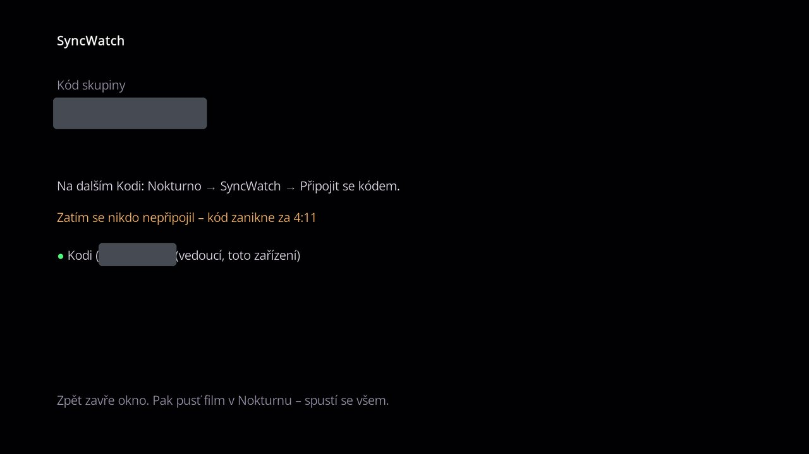

# SyncWatch

SyncWatch je společné sledování: jeden film nebo díl na víc zařízeních najednou – každý u sebe, ale ve stejnou chvíli. Hodí se na sledování s přáteli nebo rodinou na dálku.

## Jak to funguje

1. **Jeden založí skupinu** a stane se vedoucím: *SyncWatch → Založit skupinu (budu vedoucí)*. Dostane kód ve tvaru `SW-XXXX-XXXX`.
2. **Ostatní se připojí** přes *SyncWatch → Připojit se kódem*. Ve skupině může být vedoucí a nejvýš 4 další zařízení. Připojení čekají, až vedoucí něco pustí.
3. **Vedoucí pustí film** normálně v Nokturnu. Stejný stream se sám spustí i u ostatních; přehrávání začne, až se načte všem.
4. **Pauza, přehrávání a přetáčení** od kohokoli platí pro všechny. Když se někomu načítá, ostatní počkají.

Napoprvé se ukáže návod; volbou *Rozumím, příště nezobrazovat* ho vypneš.

## Co je potřeba

Všichni pustí **přesně tentýž stream** – stejnou kvalitu, zvuk i délku – a každý přes svůj vlastní účet u zdroje. Kdo účet u zdroje, ze kterého vedoucí pouští, nemá, tomu se stream nespustí. Nejjednodušší je pouštět ze zdroje, který mají všichni (HellSpy účet nepotřebuje vůbec).

## Ve skupině

Menu SyncWatch ukazuje kód skupiny, tvoji roli a kolik zařízení je připojeno. Kód je vidět i přímo v hlavním menu u položky SyncWatch.

- **Zavřít skupinu pro další zařízení** / **Otevřít skupinu pro další zařízení** (vedoucí) – nikdo další se nepřipojí.
- **Ukončit sledování pro všechny** (vedoucí) – skupina skončí všem.
- **Opustit skupinu** (člen) – ostatní sledují dál.
- **Vrátit se do filmu** – když člen omylem zastaví přehrávání, zůstane ve skupině. Tato položka ho vrátí do filmu na místo, kde skupina právě je.

Skupina zanikne, když se k ní 5 minut nikdo nepřipojí, nebo když ji vedoucí ukončí.

## Soukromí

Co sledujete, server nevidí – název titulu i jména zařízení jsou zašifrované kódem skupiny. Kód proto dávej jen lidem, se kterými chceš sledovat.
