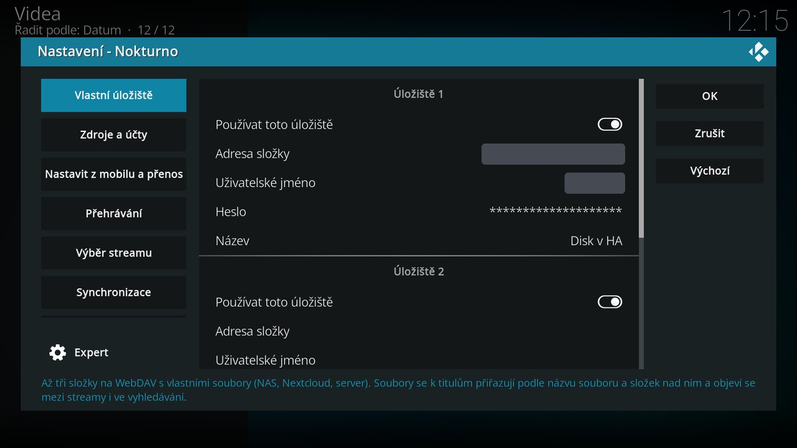
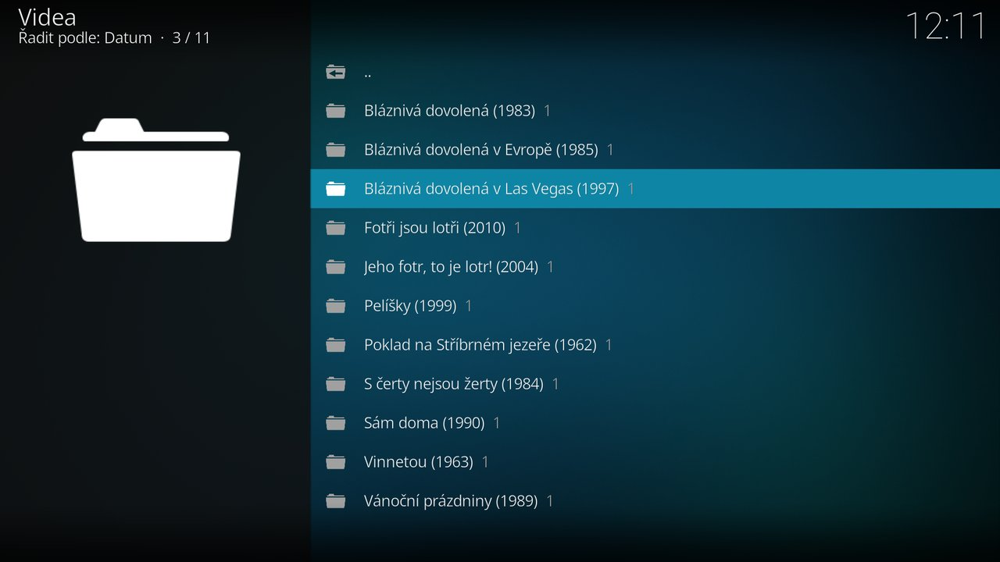

# Vlastní úložiště

Hlavní funkcí Nokturna je přehrávání **tvých vlastních souborů** – na NAS, v Nextcloudu nebo na libovolném serveru s WebDAV. Soubor, který k titulu patří, se objeví **mezi streamy jako první** a pustí se stejně jako ostatní. Nastavit jde až **tři úložiště**.

Stejná úložiště umí i [integrace pro Home Assistant](../ha/nastaveni.md#vlastni-uloziste) a [doplněk pro Stremio](../stremio/zdroje-a-nastaveni.md#vlastni-uloziste).

## Co je potřeba

- Složka dostupná přes **WebDAV** (`http://` nebo `https://`). Umí to Synology a QNAP (balíček WebDAV Server), Nextcloud, ownCloud i obyčejný Apache nebo nginx. Stačí i server, který umí jen **výpis složky** v HTML – doplněk si s ním poradí taky.
- Jméno a heslo, pokud je úložiště chráněné (HTTP Basic). Bez hesla nech pole prázdná.
- Úložiště musí být **dosažitelné z Kodi** – adresa v domácí síti funguje jen doma, mimo domov je potřeba veřejná adresa nebo VPN.

Do úložiště se nic nezapisuje a nic se v něm nevytváří – žádné `.nfo`, `.strm` ani XML. Doplněk soubory jen čte.

## Nastavení



*Nastavení → Vlastní úložiště*, pro každé úložiště (1–3):

| Pole | K čemu | Příklad |
|---|---|---|
| **Používat toto úložiště** | vypnuté úložiště zůstane vyplněné, jen se v něm nehledá a v menu se neukáže | |
| **Adresa složky** | WebDAV složka s filmy a seriály. Prázdné = úložiště vypnuté. Tvar `davs://` z Kodi jde taky. | `https://nas.example.cz:5006/video/` · `https://cloud.example.cz/remote.php/dav/files/jmeno/Video/` |
| **Uživatelské jméno** | přihlášení k úložišti | `nokturno` |
| **Heslo** | heslo k úložišti | |
| **Název** | ukáže se u streamů, ať je jasné, odkud soubor je. Prázdné = jméno serveru. | `NAS` |

Po vyplnění pusť *Nastavení → Pokročilé → Ověřit zdroje* (ve starších verzích Otestovat zdroje) – u každého úložiště ukáže, jestli se přihlášení povedlo, nebo `NAS neodpovídá` / `NAS: špatné jméno nebo heslo`.

## Jak pojmenovat soubory

Doplněk soubor k titulu přiřazuje **podle názvu souboru a podle složek nad ním** – stejně přísně jako fulltext WebShare, aby se k titulu nepřimíchal jiný. Na struktuře složek jinak nezáleží, prochází se celé úložiště.

### Filmy

```
Filmy/Pelíšky (1999).mkv
Filmy/National Lampoon's Vacation (1983)/Bláznivá dovolená (1983) 2160p CZ SK.mkv
```

- **Název na začátku**, za ním **rok** v závorce. Rok odliší stejnojmenné filmy a pokračování („Bláznivá dovolená“ 1983 × „Bláznivá dovolená v Evropě“ 1985).
- **Složka s originálním názvem** se vyplatí u filmů, které mají český název úplně jiný než originál. Kodi s TMDB zná film česky, Stremio a Cinemeta jen anglicky – se složkou `National Lampoon's Vacation (1983)` a souborem `Bláznivá dovolená (1983)…` se najde oběma cestami.
- **Kvalita a jazyky v názvu** (`2160p`, `1080p`, `CZ`, `SK`, `titulky`) pomůžou řazení a filtru streamů. Zvukové stopy si doplněk stejně dočte z hlavičky souboru (MKV, MP4, AVI).

### Seriály

```
Seriály/Okresní přebor/Okresní přebor S01E02 - Nábor.mkv
Seriály/Hospoda/Hospoda S02E04 - Úraz.avi
```

- **Značka dílu `S01E02` je nutná** (jde i `1x02`). Bez ní doplněk nepozná, o který díl jde – soubory pojmenované jen `1. Závěť.avi` se nenabídnou.
- Název seriálu může být v názvu souboru, nebo jen ve složce nad ním (`Seriály/Sherlock/Season 1/S01E02.mkv` taky projde).
- Číslo série a dílu musí sedět na katalog (TMDB). Když má seriál v katalogu dvě série po 26 dílech, je 27. díl `S02E01`.

Podporované přípony: `mkv mp4 avi m4v mov ts m2ts wmv webm mpg mpeg flv iso`. Soubory a složky začínající tečkou a systémové složky NAS (`@eaDir`, `#recycle`) se přeskakují.

## Kde se soubory objeví

- **U titulu mezi streamy** – vždy **první**, na začátku řádku zelený název úložiště, za ním kvalita, zvuk, velikost a délka. Pouští se rovnou z úložiště.
- **Moje úložiště** v hlavním menu – procházení úložiště po složkách; u složky je počet videí uvnitř. Při víc úložištích se napřed vybírá úložiště.
- Ve **výsledcích hledání** se soubory neukazují – hledání je o titulech, soubor přijde na řadu až u titulu.



## Kdy doplněk uvidí nový soubor

Seznam souborů si doplněk pamatuje **hodinu**, takže nově nahraný soubor se ukáže nejpozději do hodiny. Chceš-li to rychleji, ulož do kořene složky soubor `.nokturno-rev` a po každé změně v úložišti změň jeho obsah (třeba na aktuální čas). Jakmile se obsah změní, doplněk seznam načte znovu hned.

## Řešení problémů

| Co se děje | Proč a co s tím |
|---|---|
| Soubor se u titulu nenabídne | Zkontroluj název: u seriálu značku `S01E02`, u filmu název na začátku a rok. U filmu s jiným českým a originálním názvem přidej složku s originálem. Nový soubor může trvat až hodinu (viz výše). |
| Díly seriálu se nenabídnou, film ano | Soubory nemají značku dílu, nebo nesedí číslování sérií s katalogem. |
| `Ověřit zdroje` hlásí „… neodpovídá“ | Adresa není z Kodi dosažitelná – jiná síť, vypnutý server, port, který není vystavený ven. Zkus adresu otevřít v prohlížeči na stejné síti jako Kodi. |
| „… špatné jméno nebo heslo“ (v menu „… nesedí jméno nebo heslo“) | Přihlašovací údaje k úložišti, ne k Nokturnu. |
| Stream se nabídne, ale nepřehraje | Úložiště vrací soubor pomalu nebo přeruší přenos; zkus soubor stáhnout prohlížečem. U 4K přes internet rozhoduje hlavně rychlost linky. |
