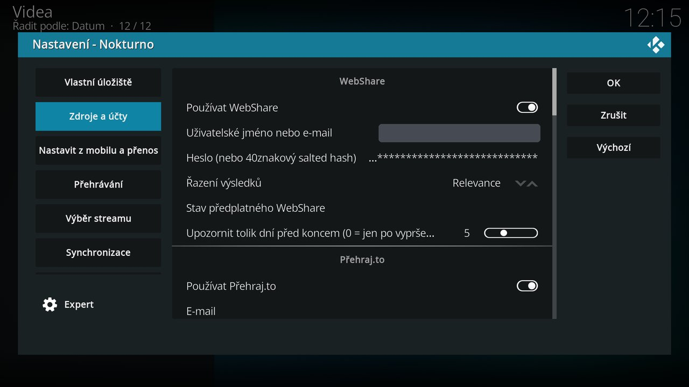
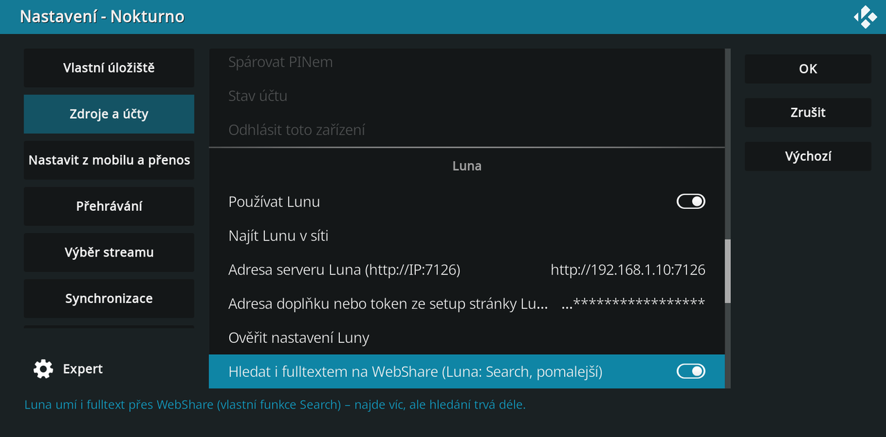

# Zdroje a účty

Hlavní funkcí Nokturna je [vlastní úložiště](vlastni-uloziste.md). Vše na této stránce jsou **volitelné vyhledávače třetích stran** – zapneš si je jen ty, se svým účtem, doplněk sám žádný obsah nehostuje (viz [Právní upozornění](index.md#pravni-upozorneni)).

Všechno je v jedné kategorii nastavení **Zdroje a účty**. Každý zdroj má vlastní skupinu, pořadí na této stránce odpovídá pořadí v nastavení. Zapnout můžeš jeden zdroj, několik, nebo všechny – navzájem se neruší, jejich výsledky se sloučí do jednoho seznamu streamů.

Pohodlnější než ovladač je [Nastavit z mobilu](nastaveni.md#nastavit-z-mobilu): účty vyplníš v prohlížeči telefonu.

## Předpoklady v kostce

| Zdroj | Co dává | Co potřebuje |
|---|---|---|
| **Vlastní úložiště** | tvoje soubory z NAS, Nextcloudu nebo serveru, vždy první mezi streamy | adresa WebDAV složky, případně jméno a heslo |
| **WebShare** | fulltextové hledání a přehrávání | účet WebShare (k přehrání VIP) |
| **Přehraj.to** | fulltextové hledání a přehrávání | nic; s účtem Premium další strany výsledků a původní soubor |
| **Sosáč** | katalogy, CZ dabing a titulky, streamy | katalogy bez účtu, k přehrání účet Streamuj.tv |
| **HellSpy** | fulltextové hledání původních souborů | nic |
| **Sledujteto** | fulltextové hledání a přehrávání | účet Sledujteto, k přehrání Premium |
| **FastShare / Sdilej.cz** | fulltextové hledání a přehrávání | hledání nic, k přehrání účet s kreditem nebo neomezeným stahováním |
| **CZtor** | hledání i podle IMDb id, zvuk, titulky a rozlišení rovnou ze zdroje | předplatné cztor.com, spárování PINem |
| **Luna** | streamy s poznanou kvalitou a jazykem, katalogy, české popisy | běžící server Luna a účet **WebShare VIP** |
| **OpenSubtitles** | české a slovenské titulky, když je zdroje nemají | nic (5 za den), s účtem 20 za den |
| **TMDB API** | české popisy (i v katalozích ze Sosáče), herci a katalogy i bez Luny | vlastní klíč zdarma (nepovinné) |
| **Trakt.tv** | zhlédnuté i na Traktu, hlídání titulů z watchlistu | účet Trakt.tv (stačí free) |

Co zdroj zrovna dělá, ukazuje řádek nahoře v hlavním menu se jménem zdroje a problémem, třeba „Luna: server neodpovídá“ – objeví se, jen když je co řešit (viz [Používání](pouzivani.md#stav-zdroju)). Všechny zapnuté zdroje naráz ověří *Nastavení → Pokročilé → Ověřit zdroje* (ve starších verzích Otestovat zdroje).

## WebShare

Hledání a přehrávání souborů přímo na [WebShare](https://webshare.cz), tvým účtem. Hledá se v několika variantách názvu (s rokem, bez roku, podle originálu), takže se najdou i soubory, které by jinak zůstaly nespárované.

- **Používat WebShare**
- **Uživatelské jméno nebo e-mail**, **Heslo (nebo 40znakový salted hash)** – heslo může být i salted hash, jaký používá oficiální doplněk WebShare pro Stremio.
- **Řazení výsledků** – Relevance / Nejnovější / Hodnocení / Největší / Nejmenší.
- **Stav předplatného WebShare** – kolik dní VIP zbývá.
- **Upozornit tolik dní před koncem (0 = jen po vypršení)** – od té chvíle doplněk upozorňuje každý den, dokud předplatné nevyprší.

Soubory, které uživatelé WebShare hodnotí převážně záporně, se v běžném seznamu streamů neukazují; volnější hledání podle názvu souboru je ukáže.

## Přehraj.to

Hledání a přehrávání na [prehraj.to](https://prehraj.to). Je to jiná služba než Sledujteto, s vlastními účty – Premium na jedné na druhé neplatí.

- **Používat Přehraj.to** – zapnuté už ve výchozím stavu, funguje i bez účtu.
- **E-mail**, **Heslo** – nepovinné. **Bez účtu** je vidět jen první strana výsledků (32 souborů) a hraje se překódovaný soubor v 1080p. **S účtem Premium** přibude stránkování a hraje se původní soubor včetně 4K. Velikost souboru se u streamu ukáže jen s účtem.
- Bez účtu Přehraj.to hlídá počet dotazů (HTTP 429). Po první odmítnuté odpovědi doplněk zdroj na 10 minut přeskočí. S účtem se toto omezení netýká.

## Sosáč

Katalogy a hledání jdou z veřejných exportů `tv.sosac.to`, bez účtu. Samotné přehrání jde přes **Streamuj.tv** a k tomu je potřeba účet.

- **Používat Sosáč**
- **Streamuj.tv uživatelské jméno**, **Streamuj.tv heslo** – heslo se ukládá jako jednosměrný otisk.
- **Dohledat streamy titulu i v druhém zdroji** – když má titul streamy jen na Sosáči nebo jen v Luně, dohledá se i v druhém. Hledání je pomalejší, ale streamů je víc.

Bez účtu Streamuj.tv katalog a hledání fungují dál, jen ze Sosáče nic nepřehraješ.

## HellSpy

Fulltextové hledání přímo na [HellSpy](https://hellspy.to) a přehrávání původních souborů. **Účet není potřeba**, stačí přepínač **Používat HellSpy**.

Když HellSpy odpoví chybou HTTP 429, **neodmítá dotazy, ale celou síť**, ze které přicházejí – typicky VPN, mobilní data nebo sdílenou adresu poskytovatele. Stav zdrojů pak hlásí „odmítá síť“ a doplněk HellSpy 10 minut přeskočí. Čekání obvykle nepomůže; pomůže vypnout VPN nebo zkusit jinou síť.

Protože se hledá podle slov v názvu souboru, může se výjimečně nabídnout soubor s podobným, ale jiným názvem. Většinu takových případů doplněk sám odfiltruje, viz [Řešení problémů](../../index.md).

## Sledujteto

Hledání a přehrávání na [Sledujteto.cz](https://www.sledujteto.cz), všechno za přihlášením.

- **Používat Sledujteto**
- **E-mail**, **Heslo** – heslo se posílá jen při přihlášení, dál jde doplněk s tokenem.
- Hledat jde s jakýmkoli účtem, **přehrát jen s Premium**. Bez něj se streamy ze Sledujteto v seznamu ukážou, ale Sledujteto k nim odkaz nevydá. Jestli je Premium aktivní, ukáže *Ověřit zdroje*.

Rozlišení a zvuk posílá Sledujteto rovnou, jazyk stop se bere z názvu souboru. Podle podmínek Sledujteto nesmí jeden účet používat lidé z různých domácností.

## FastShare / Sdilej.cz

[FastShare.cz](https://fastshare.cz) a [Sdilej.cz](https://sdilej.cz) mají stejné soubory, jen účty jsou oddělené. Nový zdroj to tedy není – vybereš, na kterém webu máš účet a kredit.

- **Používat FastShare / Sdilej.cz**
- **Účet z** – *FastShare* nebo *Sdilej.cz*.
- **Uživatelské jméno**, **Heslo** – údaje z vybraného webu. **Hledá se i bez účtu**, přihlášení je potřeba až k přehrání.
- Přehrání se odečítá z kreditu podle přenesených dat. S neomezeným stahováním se nic neodečítá. Kolik kreditu zbývá, ukáže *Ověřit zdroje*.

Rozlišení a stopáž posílá FastShare rovnou. Zvukové stopy se čtou z hlavičky souboru jen s neomezeným stahováním – na kredit by to stálo desítky MB, takže se jazyk jinak odhaduje z názvu souboru (`~CZ`). S volbou *Sdilej.cz* se streamy v seznamu hlásí jako Sdilej.cz.

Podrobně v nápovědě: [FastShare s účtem ze Sdilej.cz](../../cs/sdilej-cz.md).

## CZtor

Placený katalog [cztor.com](https://cztor.com) se soubory na giganthost.com. Zvuk, titulky a rozlišení posílá rovnou.

- **Používat CZtor**
- **Spárovat PINem** – na TV se ukáže PIN, zadáš ho na `cztor.com/activate`. **Heslo se do doplňku nezadává** a doplněk ho nikdy nevidí.
- **Stav účtu** ukáže předplatné a dokdy platí, **Odhlásit toto zařízení** párování zruší.

Spárování platí jen pro jedno zařízení. Při [přenosu nastavení](synchronizace.md#prenos-nastaveni-do-dalsiho-kodi) ani při synchronizaci se nekopíruje – na dalším Kodi spáruješ znovu.

Podrobně v nápovědě: [CZtor: „zařízení není spárované“](../../cs/cztor.md).

## Luna

Luna: Absolute Cinema je samostatný server, který si provozuješ. Nokturno si z něj bere streamy s předem poznanou kvalitou a jazykem, katalogy a české popisy. Luna vždy potřebuje účet **WebShare VIP**.

Luna může běžet třemi způsoby: jako **aplikace přímo na Android TV boxu** (adresa v Nokturnu je pak `http://127.0.0.1:7126`), jako **program na počítači nebo NAS** (Windows, Linux, macOS), nebo jako **doplněk Home Assistantu**. Home Assistant tedy potřeba není.

- **Používat Lunu** – v nové instalaci vypnuté.
- **Najít Lunu v síti** – projde domácí síť a adresu vyplní samo.
- **Adresa serveru Luna (http://IP:7126)**
- **Adresa doplňku nebo token ze stránky /setup Luny** – vlož celou adresu ze stránky `/setup` Luny, doplněk si z ní vezme token i adresu.
- **Ověřit nastavení Luny** – řekne přesně, co nesedí: server neodpovídá, chybí token, Luna token nepřijala, nebo v ní chybí účet WebShare.
- **Hledat přes Lunu i fulltextem na WebShare (pomalejší)** – najde víc souborů, hledání trvá déle.

Postup krok za krokem, se všemi obrazovkami a významem hlášek, je na stránce **[Nastavení Luny krok za krokem](nastaveni-luny.md)**. Podrobnosti o samotné Luně jsou ve vlákně [Luna: Absolute Cinema na stremio.cz](https://stremio.cz/d/47-luna-absolute-cinema-addon-pro-prehravani-sifrovaneho-obsahu-z-webshare).

Když Luna neodpovídá, doplněk ji přeskočí a hledá v ostatních zdrojích; řádek nahoře v hlavním menu to ukáže.

## OpenSubtitles

U titulů, ke kterým zdroje nemají české ani slovenské titulky, je doplněk dohledá na opensubtitles.com. Hledá podle IMDb id a u seriálu podle série a dílu, takže se nepřichytí titulky k jinému dílu. Stahuje se nejvýš jeden soubor, a až při přehrání.

- **Používat OpenSubtitles** – zapnuté ve výchozím stavu.
- **Účet na OpenSubtitles (nepovinný)**, **Heslo na OpenSubtitles** – bez účtu 5 titulků denně, se zdarma založeným účtem 20.
- **Ověřit OpenSubtitles** (ve starších verzích Vyzkoušet OpenSubtitles) – ověří spojení, účet a kolik titulků dnes zbývá.

Pořadí titulků ze všech zdrojů se řídí preferovaným jazykem (čeština, pak slovenština, nebo obráceně).

## TMDB API

Katalogy **Filmy** a **Seriály** a hledání titulů fungují vždy, i bez jediného zdroje. Popisy, plakáty a herce bere doplněk z databází filmů v tomto pořadí:

1. **TMDB** s vlastním klíčem – česky, včetně popisu, herců a žánrů, i u úplně nových titulů.
2. **Luna**, když klíč TMDB nemáš.
3. **Veřejný katalog Sosáče** – české názvy a žánry, ale bez popisu.
4. **Cinemeta** – funguje vždy, ale jen anglicky.

Každá další se zkusí, jen když předchozí nic nevrátila. S klíčem TMDB jsou české popisy i v katalozích ze Sosáče (Nově přidané s CZ/SK dabingem a titulky).

**API klíč TMDB** je zdarma a patří jen tobě:

1. Registrace na [themoviedb.org](https://www.themoviedb.org).
2. Ikona profilu → **Nastavení → API** (v levém menu).
3. **Request an API Key → Developer** → krátký formulář, jako název aplikace stačí „Nokturno“.
4. Zkopíruj **API Key (v3 auth)** – ne delší „API Read Access Token“.
5. Vlož ho do pole **API klíč TMDB**.

## Trakt.tv

Co sleduješ a co označíš jako zhlédnuté, se zapisuje i na [Trakt.tv](https://trakt.tv). Tituly z tvého watchlistu na Traktu doplněk hlídá stejně jako [Hlídané](hlidane.md).

- **Používat Trakt.tv**
- **Přihlásit se k Traktu (kódem zařízení)** – na TV se ukáže kód, zadáš ho na `trakt.tv/activate`. Vlastní aplikaci na Traktu zakládat nemusíš. Stačí free účet; ten může mít připojené dvě aplikace naráz.
- **Vlastní Trakt client id (nepovinné)**, **Vlastní Trakt client secret (nepovinné)** – nech prázdné, použije se aplikace Nokturna. Vyplň jen, když máš vlastní aplikaci na developer.trakt.tv.
- **Odhlásit se z Traktu**

Přihlášení k Traktu se stejně jako CZtor nepřenáší na další Kodi.

Podrobně v nápovědě: [Trakt.tv: přihlášení kódem](../../cs/trakt.md).

---

Pokračuj na [Nastavení](nastaveni.md) (přehrávání, výběr streamu, stahování a další) nebo na [Používání](pouzivani.md).
