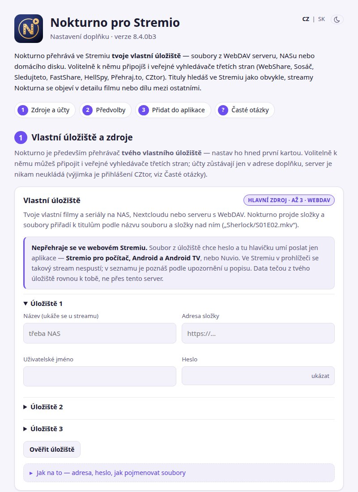

# Instalace

## 1. Stáhni a spusť aplikaci

Z [vydání na GitHubu](https://github.com/nokturno-app/nokturno-stremio-app/releases/latest) stáhni soubor pro svoje
zařízení (Windows, macOS s čipem Apple nebo Intel, Linux amd64/arm64/arm/386, APK pro Android a Android TV) a spusť ho.
Postup pro každý systém včetně hlášek Windows a macOS je v článku [Nokturno pro Stremio – aplikace](../../cs/stremio-aplikace.md).

Aplikace poslouchá na portu **7140** (nastavení a doplněk přes http) a **7141** (HTTPS pro Stremio z jiného zařízení v síti).
Musí běžet, kdykoli se díváš – nejlíp na zařízení, které je pořád zapnuté, nebo přímo na tom, kde Stremio pouštíš.

## 2. Otevři formulář nastavení

- Na zařízení, kde aplikace běží: `http://127.0.0.1:7140/configure`.
- Z telefonu nebo počítače ve stejné síti: `http://<IP adresa zařízení s aplikací>:7140/configure`. IP adresu vypíše
  aplikace při startu, na Androidu je na hlavní obrazovce.

Formulář provede třemi kroky: zdroje a účty, předvolby a přidání do aplikace.

### Zdroje
Stačí jeden zdroj, víc zdrojů najde víc streamů. U každého je rozbalovací návod (registrace, co vyplnit) a tlačítko,
které účet rovnou ověří – **Ověřit účet**, u vlastního úložiště **Ověřit úložiště**, u CZtoru **Spárovat CZtor**.
Podrobnosti ke zdrojům jsou na stránce [Zdroje a nastavení](zdroje-a-nastaveni.md).

### Předvolby (nepovinné)
Jazyk zvuku (čeština, slovenština, angličtina, maďarština), řazení streamů, skrytí SD, upřednostnění zvuku 5.1
a [katalogy](zdroje-a-nastaveni.md#katalogy). Výchozí nastavení sedí většině lidí.

## 3. Přidej doplněk do aplikace

- **Počítač** – klikni na **Přidat do Stremia**, prohlížeč se zeptá, jestli otevřít Stremio, a ve Stremiu potvrď **Instalovat**.
- **Telefon** – otevři formulář v telefonu, kde máš Stremio, a postupuj stejně. Když se aplikace neotevře, použij
  **Zkopírovat adresu** a vlož ji ručně: *Doplňky → pole nahoře → Instalovat*.
- **Nuvio** (telefon i TV) – klikni na **Přidat do Nuvia**. Nuvio na TV bez prohlížeče: **Zkopírovat adresu** a vlož ji v Nuviu mezi doplňky.
- **Streamlet** – odkaz pro přidání doplňku nemá. Použij **Zkopírovat adresu** a vlož ji ve Streamletu jako doplněk Stremia.
- **Televize** – nainstaluj doplněk na počítači nebo telefonu **pod stejným účtem Stremio**. Doplňky se mezi zařízeními
  synchronizují samy a na TV se objeví do minuty.

Když formulář otevřeš přes IP adresu, dostane doplněk adresu `https://<IP s pomlčkami>.my.local-ip.co:7141`.
Stremio totiž z jiného zařízení přijme jen HTTPS. Jméno přeloží služba local-ip.co zpátky na tvoji domácí IP,
data tečou jen po tvé síti. Aby adresa platila i po restartu routeru, nastav zařízení s aplikací v routeru pevnou IP.

> Adresa doplňku obsahuje tvoje účty. Není zašifrovaná, jen zakódovaná – kdo ji má, přehrává přes tvoje účty. Nikomu ji neposílej.

## Změna nastavení

Ve Stremiu **Doplňky → Nokturno → ozubené kolo (Konfigurovat)** otevře formulář s tvým současným nastavením. Po úpravě
znovu klikni na **Přidat do Stremia** (nebo Nuvia). Změněné nastavení je nová adresa – starou verzi doplňku pak odinstaluj,
ať nemáš Nokturno dvakrát.

## Aktualizace

Aplikace se aktualizuje sama, při startu a pak každých 6 hodin. Když nová verze nenaběhne, vrátí předchozí.
